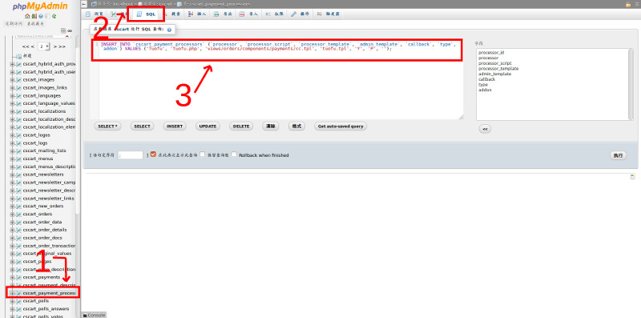
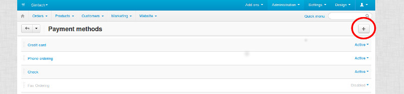
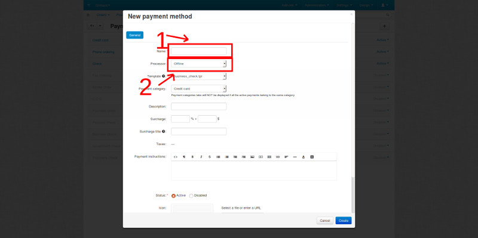
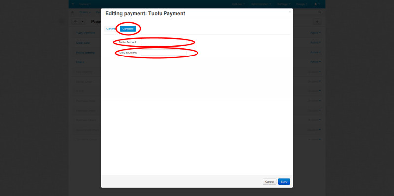

# cscart-paytos-payment

## cscart 托付支付安装方法

### 解压并复制文件
#### 解压文件
tar -xvf cscart-tuofu-payment.tar.gz
#### 修改文件属主
chown www:www tuofu.php tuofu.tpl
#### 将tuofu.php放到/app/payments目录下
mv tuofu.php /home/wwwroot/bellshoe.com/app/payments/
#### 将tuofu.tpl放到/design/backend/templates/views/payments/components/cc_processors/目录下
mv tuofu.tpl /home/wwwroot/bellshoe.com/design/backend/templates/views/payments/components/cc_processors/

### 添加托付支付到数据库
#### 打开phpmyadmin中网站对应的数据库，选择SQL选项卡并将tuofu.sql文件中的内容粘贴进去执行

### 后台添加托付支付
#### 打开Administration -> Payment Methods点击右上角加号添加支付方式

#### 填写支付方式名称（自己随意起一个名字）和选择processor为Tuofu

#### 选择托付支付后会出现Configure选项卡，点击填入托付支付的用户名和密钥，最后单击save

#### 前台已经可以通过托付支付了，安装完毕

